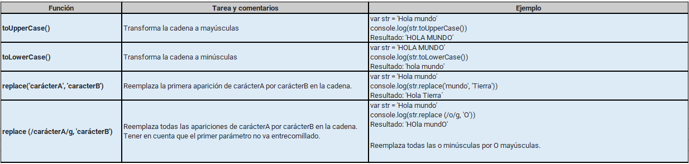
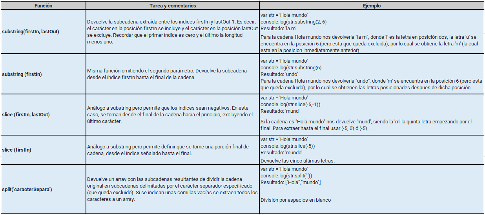
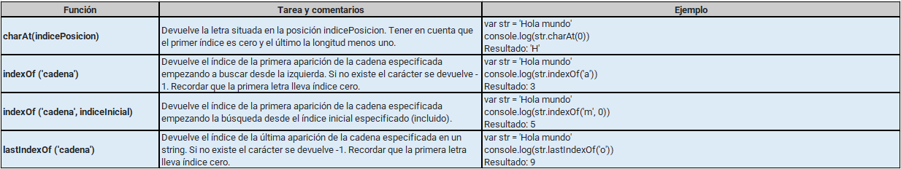
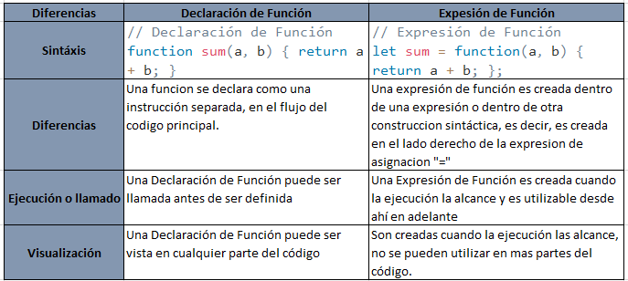

# Aprendiendo JavaScript

## 1. ¿Qué diferencia a JavaScript de cualquier otro lenguaje de programación?

Para diferenciar **JavaScript** de otros lenguajes de programación, debemos tener claro primero un concepto general sobre que es **JavaScript** .

### Que es JavaScript

**JavaScript** (fue originalmente llamado "LiveScript") es un lenguaje de programación que los desarrolladores utilizan para hacer páginas web interactivas. Desde actualizar fuentes de redes sociales a mostrar animaciones y mapas interactivos, las funciones de JavaScript pueden mejorar la experiencia del usuario de un sitio web. Como lenguaje de scripting del lado del servidor, se trata de una de las principales tecnologías de la World Wide Web.

Es el único lenguaje de programación comprendido por un programa Web, su máximo potencial puede ser utilizado cuando se trabaja con _Google_ o _Mozilla Firefox_, algunas de las aplicaciones mas potentes del mundo están integradas con **JavaScript**, y es tan flexible que permite desarrollar aplicaciones móviles y es una de las herramientas mas potentes que puedes tener para quienes quieran automatizar el flujo de trabajo diario, es decir, si no quieres pasar horas frente a la computadora realizando una tarea repetitiva, puedes desarrollar una tarea automatizada con **JavaScript** que haga lo que necesitas por ti.

#### Diferencias de JavaScript frente a otros lenguajes.

Como ya lo hemos mencionado, El código **JavaScript** es interpretado, es decir, directamente traducido a código de lenguaje de máquina subyacente mediante un motor de **JavaScript**  En el caso de otros lenguajes de programación, un compilador se encarga de compilar todo el código en código de máquina en un paso diferente.

#### ¿Qué es un motor de JavaScript?

Un motor JavaScript es un programa de computación que ejecuta código JavaScript. Los primeros motores de JavaScript eran verdaderos intérpretes, pero todos los motores modernos utilizan el método justo a tiempo o la compilación en tiempo de ejecución para mejorar el rendimiento. Esta característica hace que el código que se esta ejecutando cuando el cliente esta realizando alguna acción, sea mas rápido, ya que en este caso el motor esta dentro del código del mismo navegador.

#### A tener en cuenta:

Cuando hablamos de lenguajes de programación, debemos diferenciar entre Java y JavaScript, ya que muchas personas suelen pensar que es un mismo lenguaje, sus principales diferencias radican en:

* **Ejecución:** Java se ejecuta en la JVM (Java Virtual Machine), lo que permite independencia del sistema operativo, mientras que JavaScript se ejecuta en navegadores y entornos como Node.js.
* **Tipado:** Java es un lenguaje de tipado fuerte y estático, lo que reduce errores en tiempo de ejecución, mientras que JavaScript tiene tipado dinámico y flexible.
* **Ámbito de uso:** Java es ampliamente utilizado en aplicaciones empresariales, sistemas backend y desarrollo móvil con Android, mientras que JavaScript domina en el desarrollo web y aplicaciones frontend.
* **Seguridad:** Java incluye controles estrictos de seguridad y gestión de memoria, mientras que JavaScript, al ejecutarse en el navegador, es más susceptible a vulnerabilidades como el Cross-Site Scripting (XSS).
* **Escalabilidad:** Java ha demostrado su eficacia en aplicaciones a gran escala, mientras que JavaScript es más común en proyectos ágiles y de menor envergadura.

### Beneficios de JavaScript.


* #### Fácil de aprender

Para iniciar en el mundo de la programación, muchos recomiendan el uso de **JavaScript**, ya que se basa en el lenguaje de programación Java y resulta fácil de aprender y codificar, se utiliza en casi cualquier sitio web y aplicación móvil.

* #### Reducción de carga del servidor

Puede utilizar **JavaScript** para reducir la carga del servidor y la congestión de la red ya que es posible ejecutar operaciones lógicas y realizar gran parte del trabajo del servidor en el propio cliente

* #### Ejecución versátil.

Para realizar las pruebas de código de **JavaScript**, lo podemos realizar directamente en la consola del navegador, ya que éstas tienen su propio motor de **JavaScript** y permiten su ejecución en tiempo real

## 2. ¿Cuáles son algunos tipos de datos JS?

Para describir cuales son los tipos de datos de JS, vamos a comprender&#x20;

### ¿Qué es un tipo de datos?

Un tipo de datos e la forma en la que JavaScript clasifica nuestros puntos de datos. Un tipo de datos en la forma en la que JavaScript ve ese tipo de variable, ejemplo: puede identificar cuando una variable es de tipo texto o de tipo numérico.

En JavaScript existen varios tipos de datos, pero los más utilizados son:

* **Número (number)**: El tipo number representa tanto números enteros como de punto flotante.

<mark style="color:blue;">Ejemplo:</mark>

```javascript
var age = 12;
console.log(age);
//Vamos a obtener como resultado 12
```

* **String**: Un string en JavaScript es una cadena de caracteres y debe colocarse entre comillas, pueden ser comillas simples o comillas dobles.

<mark style="color:blue;">Ejemplo:</mark>

```javascript
var nombre = ‘Erica’;
var nombreDos = “Paula”;
console.log(nombre);
//Vamos a obtener como resultado: Erica
console.log(nombreDos);
//Vamos a obtener como resultado: Paula
```


* **Boolean (tipo lógico)**: El tipo booleano tiene sólo dos valores posibles: `true` y `false.`

<mark style="color:blue;">Ejemplo:</mark>

```javascript
var confiable = true;
var noConfiable = false;
console.log(confiable);
//Vamos a obtener como resultado true
console.log(noConfiable);
//Vamos a obtener como resultado false
```

* **El valor “null” (nulo)**: El valor especial `null` no pertenece a ninguno de los tipos descritos anteriormente y solo puede tener un valor y es `null`.

<mark style="color:blue;">Ejemplo:</mark>

```javascript
var nully = null;
console.log(nully);
//Vamos a obtener como resultado null (lo cual nos indica que no existe ningún valor)
```


* **El valor “undefined” (indefinido)**: El valor especial `undefined` también se distingue. Hace un tipo propio, igual que `null`. El significado de `undefined` es “`valor no asignado`”.

<mark style="color:blue;">Ejemplo:</mark>

```javascript
var apellido;
console.log(apellido);
//Vamos a obtener como resultado var no definido (en este caso, a la variable apellido no se le ha asignado ningún valor)
```


* **Object y Symbol**: El tipo `object` (objeto) es especial. Todos los demás tipos se llaman “_primitivos_” porque sus valores pueden contener una sola cosa (ya sea una cadena, un número o lo que sea). Por el contrario, los objetos se utilizan para almacenar colecciones de datos y entidades más complejas. El tipo `symbol` (símbolo) se utiliza para crear identificadores únicos para los objetos.

<mark style="color:blue;">Ejemplo:</mark>

<pre class="language-javascript"><code class="lang-javascript">var mySym = Symbol();
console.log(muSym);
<strong>//Vamos a obtener como resultado un [object Symbol]{}
</strong></code></pre>

### Buenas practicas:

* Indentación de código y convenciones de nombres

La indentación de código y las convenciones de nombres son prácticas fundamentales para mantener la legibilidad y el mantenimiento del código en **JavaScript**. Estas prácticas ayudan a organizar el código de manera clara y a facilitar la comprensión de su estructura y funcionamiento

* Nombres de variables de manera descriptiva

Al elegir nombres para variables, funciones y objetos en **JavaScript**, es importante seguir ciertas convenciones y prácticas recomendadas:

1. Utilizar nombres descriptivos y significativos que indiquen claramente el propósito de la variable, función u objeto.
2. Utilizar la notación camelCase para variables y funciones, donde la primera letra de cada palabra, excepto la primera, se escribe en mayúsculas. <mark style="color:blue;">Ejemplo:</mark> `miVariable`.
3. Utilizar la notación PascalCase para nombres de clases y constructores, donde la primera letra de cada palabra se escribe en mayúsculas. <mark style="color:blue;">Ejemplo:</mark> `MiClase`.
4. Utilizar nombres en mayúsculas con guiones bajos para constantes. <mark style="color:blue;">Ejemplo:</mark> `MI_CONSTANTE`.
5. Evitar el uso de nombres de una sola letra, a menos que sean variables de iteración en bucles, como i, j o k.
6. No utilizar nombres reservados por **JavaScript**, como `function, var, let, const`, entre otros.

## 3. ¿Cuáles son las tres funciones de String en JS?

### Que es una función?

Una función en **JavaScript** es aquella que te permite encapsular un comportamiento. Estas funciones las proporciona la biblioteca de **JavaScript** por lo que simplemente podemos llamarlas, aunque también podemos crear funciones personalizadas que utilizaremos repetitivamente cuando las necesitemos.

En JavaScript, encontramos 3 tipos de funciones de String.

1. **Funciones modificadoras**

<figure><figcaption></figcaption></figure>

2. **Funciones para extraer subcadenas y caracteres**

<figure><figcaption></figcaption></figure>

3. **Funciones para recuperar índices de posiciones**

<figure><figcaption></figcaption></figure>

Para ver otras funciones de String puedes acceder a este enlace: [https://developer.mozilla.org/es/docs/Web/JavaScript/Reference/Global\_Objects/String](./)

### Recomendaciones:

Se debe tener en cuenta que, para el uso de estas funciones, las cadenas de caracteres empiezan desde el índice _**0**_ y para calcular el final debemos contar todos los caracteres de la cadena y se le resta un _**1**_.

Utilizar las funciones existentes en la librería que nos aporta **JavaScript**, evitar crear nuevas (a menos que sean estrictamente necesarias).

## 4. ¿Qué es un condicional?

Un condicional te permite tener un comportamiento dinámico en tu aplicación, todos los lenguajes de programación cuentan con lo que se conoce como estructuras condicionales. Estas estructuras, se conocen a su vez como estructuras de control de flujo, ya que, a través de ellas, podemos controlar qué partes de código van a ejecutarse en nuestra aplicación y cuáles no.

<mark style="color:blue;">Ejemplo:</mark> cuando el semáforo este en rojo, debo detenerme, si esta en verde, puedo seguir.

Estos condicionales se crean a través de las sentencias `if, if…else` y `switch`.

Las sentencias `if` y `if…else` son estructuras de control de flujo usadas en **JavaScript**. El flujo de código condicional permite elegir la siguiente instrucción dependiendo de la respuesta o el resultado. Gracias a las sentencias `if` y `if…else`, el programa toma una decisión de cómo ejecutar el código si se cumple o no una condición necesaria.

<mark style="color:blue;">Ejemplo:</mark>

```javascript
if (condición) {
// bloque de código a ejecutar si la condición es verdadera
}else {
// bloque de código a ejecutar si la condición es falsa
}
```

Para poder validar si una condición es verdadera o falsa, podemos hacer uso de ciertos operadores lógicos y operadores de comparación como, por ejemplo

1. **Operadores de comparación**

Los operadores de comparación a su vez, están divididos en dos clases:

* **Operadores de igualdad**

Los **operadores de comparación de igualdad** son aquellos que utilizamos en nuestro código (generalmente, en el interior de un `if` para realizar comprobaciones. Estas expresiones de comparación devuelven un  booleano con un valor de true o false.

* **Operador de igualdad** == `(a == b)`

Comprueba si el **valor** de `a` es igual al de `b`. **No comprueba tipo de dato**.

<mark style="color:blue;">Ejemplo:</mark>

```javascript
10 == 10 // true
5 == 10 // false
```

* **Operador de desigualdad** != `(a != b)`

Comprueba si el **valor** de `a` no es igual al de `b`. **No comprueba tipo de dato**.

<mark style="color:blue;">Ejemplo:</mark>

```javascript
10 != 6 // true
10 != 10 // false
```

* **Operador mayor que** > `(a > b)`

Comprueba si el valor de `a` es mayor que el de `b`.

<mark style="color:blue;">Ejemplo:</mark>

```javascript
10 > 5 // true
10 > 50 // false
```

* **Operador mayor/igual que** >= `(a >= b)`

Comprueba si el valor de `a` es mayor o igual que el de `b`.

<mark style="color:blue;">Ejemplo:</mark>

```javascript
10 >= 10 // true
10 >= 50 // false
```

* **Operador menor que** < `(a < b)`

Comprueba si el valor de `a` es menor que el de `b`.

<mark style="color:blue;">Ejemplo:</mark>

```javascript
10 < 15 // true
10 < 50 // false
```

* **Operador menor/igual que** <= `(a <= b)`

Comprueba si el valor de `a` es menor o igual que el de `b`.

<mark style="color:blue;">Ejemplo:</mark>

```javascript
10 <= 10 // true
10 <= 50 // false
```


2. **Operadores de identidad**

A parte de los **operadores de igualdad**, JavaScript es un lenguaje que también tiene **operadores de identidad**. Estos operadores se diferencian a los dos primeros anteriores en que en lugar de dos símbolos de igual `==`, utiliza tres `===`:

* **Operador de identidad** === `(a === b)`

Comprueba si el **valor y el tipo de dato** de `a` es igual al de `b`.

<mark style="color:blue;">Ejemplo:</mark>

```javascript
10 === 10 // true
“10” === 10 // false
```

* **Operador no idéntico** !== `(a !== b)`

Comprueba si el **valor y el tipo de dato** de `a` no es igual al de `b`.

<mark style="color:blue;">Ejemplo:</mark>

```javascript
10 !== 10 // false
“10” !== 10 // true
```

3. **Operadores de lógicos**

Para crear condiciones compuestas, también puedes usar los siguientes operadores lógicos:

* El **operador lógico Y (`&&`)** retorna true si ambas condiciones son verdaderas y se ejecuta el bloque de código **`if`**. De lo contrario, el operador retorna **`false`** y se ejecuta el código **`else`**.

<mark style="color:blue;">Ejemplo:</mark>

```javascript
var age = 10;
var ageTwo = “10”;
if(age === ageTwo){
    console.log(‘Son iguales’);
}
if(age !== ageTwo){
    console.log(‘No son iguales’);
}
```

En el ejemplo anterior, estamos comparando dos variables, una variable “`age`” de tipo numérico y una variable “`ageTwo`” de tipo texto, al realizar la comparación como estamos utilizando el comparador “`===`” estamos comparando si el valor y el tipo de dato son exactamente iguales, para nuestro caso, el resultado sería: `‘No son iguales’`.

```javascript
if (age <= 17){
    console.log(‘No tienes edad para conducir’);
} else{
    console.log(‘Tienes edad para conducir’);
}
```

Para el ejemplo anterior, se esta comparando el valor de la variable “`age`” con el número “`17`”, para este caso obtenemos como resultado: `‘No tienes edad para conducir’`.

```javascript
if (age >=18 && age <= 80){
    console.log(‘Tienes edad para conducir’);
}else{
    console.log(‘Necesitas una persona que te lleve’);
}
```

Para el ejemplo anterior, estamos haciendo uso de operadores lógicos y operadores de comparación, ya que estamos realizando 2 comparaciones “`age >=18`” y `age <= 80` y las estamos uniendo mediante “`&&`”, esto significa que las dos comparaciones deben ser verdaderas para que toda la condición sea _verdadera_, en caso de que una de las dos condiciones sea _falsa_, toda la condición será falsa.

* El **operador lógico O (`||`)** ejecuta el código dentro de la sentencia **`if`** si una o ambas condiciones son _verdaderas_.

<mark style="color:blue;">Ejemplo:</mark>

```javascript
var futaColorNaranja = ‘Mandarina’;
if (futaColorNaranja == “Naranja” || futaColorNaranja == “Mandarina”){
    console.log(“La fruta es de color Naranja”);
}else{
    console.log(“La fruta no es de color Naranja”);
}
```

Para el ejemplo anterior, estamos utilizando dos condicionales y los estamos uniendo con “`||`”, esto significa que cualquiera de las dos comparaciones puede ser _verdadera_ para que toda la condición sea _verdadera_.

* El **operador lógico NO (`!`)** retorna el valor contrario: si un valor es _verdadero_, lo hará _falso_ y viceversa.

<mark style="color:blue;">Ejemplo:</mark>

```javascript
var diaFeriado = “SI”;
if (!(diaFeriado == “SI”)){
    console.log(“Hay que trabajar”);
}
```

Para el ejemplo anterior, vemos que podemos hacer uso de “`!`” para cambiar el valor del resultado de la condición o del resultado de dicha condición.

### Buenas practicas.

* Para el uso de operadores de igualdad, es recomendable utilizar el operador `===` en lugar de `==` y con esto evitar inconvenientes en posteriores pasos en el tratamiento de la información.
* Conocer muy bien el condicional que se esté utilizando, y utilizar paréntesis cuando sea necesario para garantizar la evaluación deseada.

## 5. ¿Qué es un operador ternario?

El operador ternario recibe su nombre por ser el único operador en **JavaScript** que utiliza tres operandos o partes. La primera parte de una operación ternaria es una condición lógica que devuelve un valor `verdadero` o `falso`. Después de un signo de interrogación , se encuentran dos expresiones separadas por dos puntos. La primera es una expresión que se ejecuta si la condición lógica es verdadera, mientras que la segunda se ejecuta si la condición es falsa. La forma genérica de la función se muestra a continuación.

`condicion ? siCumpleCondicion : siNoCumpleCondicion`

Para entender mejor este concepto, vamos a ver el siguiente ejemplo, primero vamos a ver la forma convencional y luego vamos a ver el mismo ejemplo con el operador ternario.

```javascript
var edad = 18
var mensaje
if(edad >= 18){
mensaje = "Eres mayor de edad"
}else{
mensaje = "No eres mayor de edad"
}
console.log(mensaje)
//Vamos a ver como resultado Eres mayor de edad
```

En el ejemplo anterior, podemos ver que utilizamos la sintaxis básica de una condicional “`if`”, en la cual estamos comparando si el valor de la variable “`edad`” es mayor o igual a `18`, entonces podemos ver un mensaje “`Eres mayor de edad`”, de lo contrario, vamos a obtener el mensaje que estaría imprimiendo en el “`else`”, es decir: “`No eres mayor de edad`”.

Ahora veamos el mismo ejemplo con el operador ternario:

```javascript
var edad = 17
var mensaje = edad >= 18 ? "Eres mayor de edad" : "No eres mayor de edad"
console.log(mensaje)
```

En el ejemplo anterior, podemos observar que el código se simplifica de forma notoria, ya que no estamos haciendo uso de la sintaxis del `if…else`, sino que por el contrario estamos realizando las mismas comparaciones en una sola línea y a su vez estamos asignando el resultado de la comparación en la variable “`mensaje`”.

Esta sección del código:

```javascript
if(edad >= 18){
mensaje = "Eres mayor de edad"
}
```

Se reemplazaría por: `edad >= 18 ? "Eres mayor de edad"`

Y la sección de código correspondiente a:

```javascript
else{
mensaje = "No eres mayor de edad"
}
```

Sería remplazada por `: "No eres mayor de edad"`

### Buenas prácticas.

* Evitar crear operadores ternarios que sean muy complejos
* Usar paréntesis para evitar ambigüedades, ayudando a entender mejor el código escrito
* Si la claridad del código se ve muy compleja, es mejor usar `if/else`.

## 6. ¿Cuál es la diferencia entre una declaración de función y una expresión de función?

Para entender la diferencia entre una declaración de función y una expresión de función, vamos a ver algunos tips a continuación:

<figure><figcaption></figcaption></figure>

Conclusión.

* Las funciones son valores. Se pueden asignar, copiar o declarar en cualquier lugar del código.
* Si la función se declara como una declaración separada en el flujo del código principal, eso se llama “_Declaración de función_”
* Si la función se crea como parte de una expresión, se llama “_Expresión de función_”.
* Las Declaraciones de Funciones se procesan antes de ejecutar el bloque de código. Son visibles en todas partes del bloque.
* Las Expresiones de Función se crean cuando el flujo de ejecución las alcanza.

## 7. ¿Qué es la palabra clave "this" en JS?

En **JavaScript**, la palabra clave `this` siempre se refiere a un **objeto**. Lo que pasa es que el objeto al que se refiere variará dependiendo de cómo y dónde se llame `this`. Hay que tener en cuenta que `this` no es una variable, es una palabra clave, por lo que su valor no se puede cambiar ni reasignar.

Diferentes formas de usar la palabra “`this`”.

1. Si llamamos a `this` por sí mismo, es decir, no dentro de una función, objeto o lo que sea, se referirá al objeto de ventana global.

<mark style="color:blue;">Ejemplo:</mark>

`console.log('this alone', this);`

El resultado de la operación, al ser ejecutada dentro de la consola del navegador podemos obtener lo siguiente:

`this alone [`_`Window {0: Window, window: Window, self: Window, document: document, name: '', location: Location, …}`_`]`


2. Llamar a `this` dentro de un método de objeto

<mark style="color:blue;">Ejemplo:</mark>

```javascript
const usuario = {
    nombre: "Erica",
    apellido : "Espinosa",
    getThis : function() {
    return this;
    }
};
console.log('this in object method', usuario.getThis());
```

obtenemos el siguiente resultado:

`“this is object method”`` `_`{nombre: 'Erica', apellido: 'Espinosa', getThis: ƒ}`_

_Esto nos quiere decir que, para nuestro caso, el “`this`” hace referencia al objeto “`usuario`”_

## Buenas practicas.

* Es mejor usar `this` en situaciones donde se necesita acceder a propiedades o métodos de un objeto.
* Se debe tener cuidado al usar `this` en funciones flecha, ya que estas no tienen su propio contexto `this`, y deben ser usadas con precaución en situaciones que requieren un contexto dinámico

## 8. Enlaces sugeridos

### Diferencias JavaScript con otros lenguajes

* [https://aws.amazon.com/es/what-is/javascript/#:\~:text=El%20c%C3%B3digo%20JavaScript%20es%20interpretado,m%C3%A1quina%20en%20un%20paso%20diferente.](https://aws.amazon.com/es/what-is/javascript/)[
  ](https://aws.amazon.com/es/what-is/javascript/)
* [https://www.hackaboss.com/blog/diferencias-javascript-java](https://aws.amazon.com/es/what-is/javascript/)

### Tipos de datos de JavaScript

* [https://ifgeekthen.nttdata.com/s/post/tipos-de-datos-y-operadores-en-javascript-MC6OVBB2MMCRBYZNPR4TSDVMPPGU?language=es#:\~:text=En%20JavaScript%20podemos%20decir%20que,enteros%20como%20de%20punto%20flotante.](https://aws.amazon.com/es/what-is/javascript/)
* [https://nelkodev.com/introduccion-a-javascript-fundamentos-funcionalidades-y-buenas-practicas/#:\~:text=Copy-,Indentaci%C3%B3n%20de%20c%C3%B3digo%20y%20convenciones%20de%20nombres,de%20su%20estructura%20y%20funcionamiento.
  ](https://aws.amazon.com/es/what-is/javascript/)

### Funciones de String

* [https://www.aprenderaprogramar.com/index.php?option=com\_content\&view=article\&id=822:funciones-javascript-cadenas-texto-tolowercase-charat-substring-split-replace-replaceall-indexof-cu01142e\&catid=78\&Itemid=206
  ](https://aws.amazon.com/es/what-is/javascript/)
* [https://ebac.mx/blog/if-en-javascript#:\~:text=%C2%BFQu%C3%A9%20son%20las%20sentencias%20if%20y%20if%E2%80%A6else%20en%20JavaScript?\&text=Las%20sentencias%20if%20y%20if%E2%80%A6else%20son%20estructuras%20de%20control,o%20no%20una%20condici%C3%B3n%20necesaria.\&text=If%20eval%C3%BAa%20la%20condici%C3%B3n%20dentro,bloque%20de%20c%C3%B3digo%20se%20omite.\&text=Si%20hay%20m%C3%A1s%20de%20dos,la%20primera%20condici%C3%B3n%20es%20falsa.
  ](https://aws.amazon.com/es/what-is/javascript/)

### Condicionales de JavaScript

* [https://lenguajejs.com/javascript/operadores/comparacion/#operadores-de-identidad
  ](https://aws.amazon.com/es/what-is/javascript/)
* [https://developer.mozilla.org/es/docs/Web/JavaScript/Reference/Operators/Conditional\_operator
  ](https://aws.amazon.com/es/what-is/javascript/)

### Declaración de Funciones y expresión de Funciones

* [https://es.javascript.info/function-expressions#:\~:text=Las%20funciones%20son%20valores.,llama%20%E2%80%9CExpresi%C3%B3n%20de%20funci%C3%B3n%E2%80%9D.](https://aws.amazon.com/es/what-is/javascript/)

### Palabra clave This

* [https://www.freecodecamp.org/espanol/news/como-usar-la-palabra-clave-this-en-javascript/#clave](https://aws.amazon.com/es/what-is/javascript/)

### GITBOOK

* [https://ull-esit-pl-1617.github.io/tareas-iniciales-airam-jorge/chapter-5/Gitbook.html](https://ull-esit-pl-1617.github.io/tareas-iniciales-airam-jorge/chapter-5/Gitbook.html)
